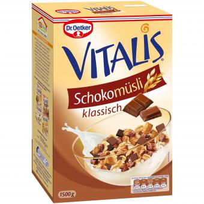

### Hallo dort 👋

Hallo ich bin der **Ognjen** und habe am [Theater Aachen](https://theateraachen.de/de_DE/home?p=1) gearbeitet.
 Ich mag es *kursiv* oder untermalt `:-)` 
Ich mache gerne `Müsli` zum Morgenessen, dies geht wie folgt:

1. Ins Rewe gehen 
2. Müsli aussuchen
3. (Optional) An die Kasse und zahlen 😄

## Wenn man es noch Süsser mag

<!-- **ognjenkoldzic/ognjenkoldzic** is a ✨ _special_ ✨ repository because its `README.md` (this file) appears on your GitHub profile.

Here are some ideas to get you started:

- 🔭 I’m currently working on ...
- 🌱 I’m currently learning ...
- 👯 I’m looking to collaborate on ...
- 🤔 I’m looking for help with ...
- 💬 Ask me about ...
- 📫 How to reach me: ...
- 😄 Pronouns: ...
- ⚡ Fun fact: ...
-->
